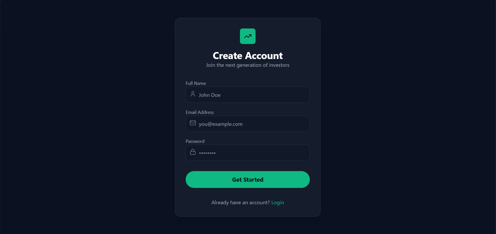
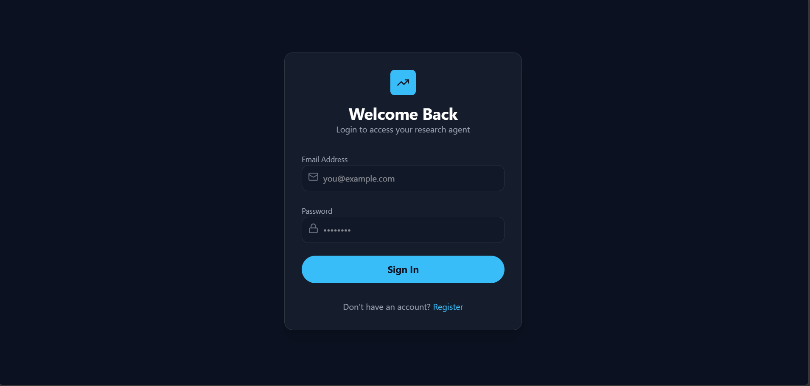
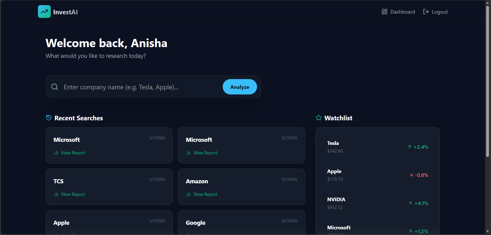
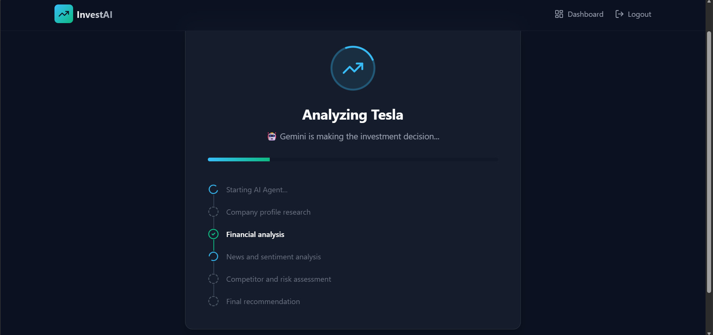
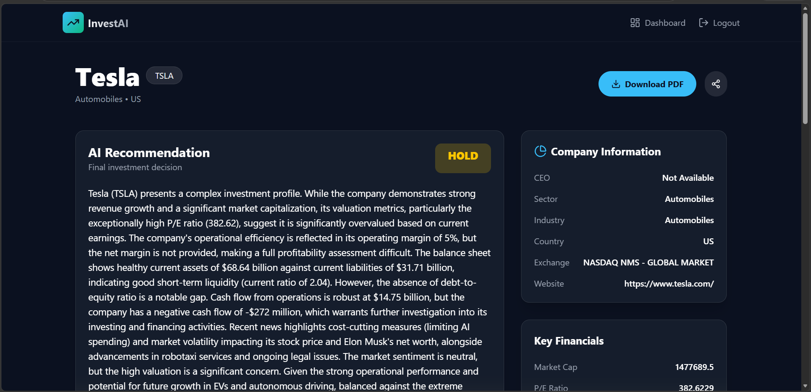
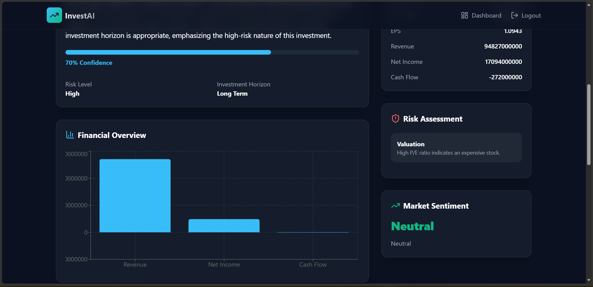
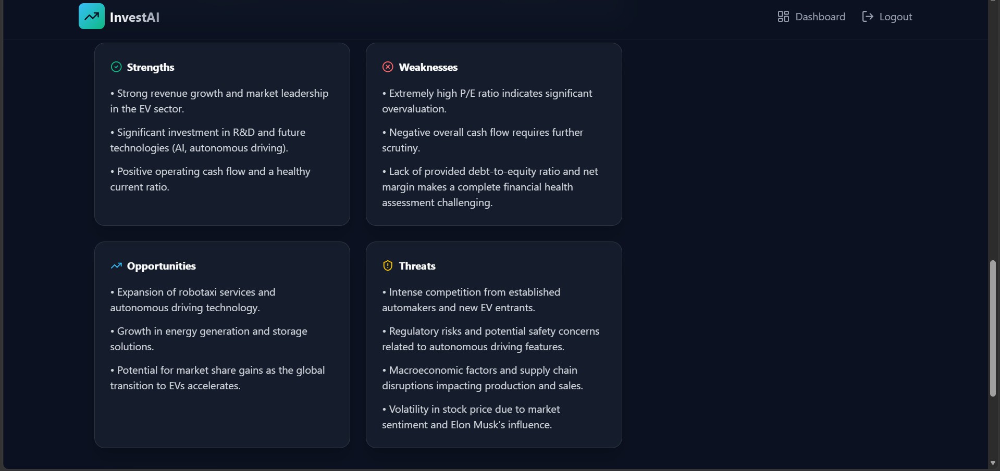

# AI Investment Research Agent

# Overview
AI Investment Research Agent is a full-stack application that helps users analyze publicly traded companies and receive an AI-generated investment recommendation.

The user enters a company name, and the system automatically:

Collects company profile information
Retrieves financial metrics
Fetches the latest news
Performs sentiment analysis
Identifies competitors
Evaluates investment risks
Uses Google's Gemini model to generate the final investment recommendation

The application presents the complete research report through an interactive dashboard and also allows users to download a PDF report.

# Features
AI-powered investment recommendation
Multi-agent workflow using LangChain
Real-time research progress using Server-Sent Events (SSE)
Company profile lookup
Financial analysis
Latest news aggregation
Sentiment analysis
Competitor analysis
Risk assessment
SWOT analysis
PDF report generation
Search history
JWT Authentication

# Tech Stack
## Frontend
React.js
Tailwind CSS
Framer Motion
Axios
Recharts
## Backend
Node.js
Express.js
MongoDB
Mongoose
## AI
LangChain.js
Google Gemini 2.5 Flash
## External APIs
Finnhub API
GNews API

# Architecture
User
   │
   ▼
React Frontend
   │
   ▼
Express Backend
   │
   ▼
Supervisor Agent
   │
   ├───────────────► Profile Agent
   │                  │
   │                  ▼
   │               Finnhub
   │
   ├───────────────► Finance Agent
   │                  │
   │                  ▼
   │               Finnhub
   │
   ├───────────────► News Agent
   │                  │
   │                  ▼
   │               GNewsAPI
   │
   ├───────────────► Sentiment Agent
   │
   ├───────────────► Competitor Agent
   │
   ├───────────────► Risk Agent
   │
   └───────────────► Investment Agent
                        │
                        ▼
                 Gemini 2.5 Flash
                        │
                        ▼
                 Final Recommendation

# Multi-Agent Workflow

The application follows a supervisor-agent architecture.

1. Supervisor Agent

Coordinates the complete workflow.

2. Profile Agent

Collects

Company Information
Industry
Headquarters
Market Capitalization

using Finnhub.

3. Finance Agent

Retrieves

PE Ratio
EPS
ROE
ROA
Cash Flow
Current Ratio
Debt to Equity
Operating Margin

from Finnhub.

4. News Agent

Collects the latest company-related news using GNewsAPI.

5. Sentiment Agent

Calculates market sentiment from news articles.

6. Competitor Agent

Identifies major competitors and compares them.

7. Risk Agent

Evaluates investment risks using predefined financial and business rules.

8. Investment Agent (Gemini)

Gemini receives all structured research data and generates:

INVEST / HOLD / PASS
Confidence Score
Investment Horizon
Risk Level
SWOT Analysis
Pros
Cons
Final Reasoning

Only this final reasoning step uses the LLM.

# API Usage

| API              | Purpose                          |
| ---------------- | -------------------------------- |
| Finnhub          | Company Profile & Financial Data |
| GNewsAPI         | Latest Company News              |
| Gemini 2.5 Flash | Final Investment Recommendation  |

# Project Structure
client/
    components/
    pages/
    services/

server/
    agents/
    controllers/
    services/
    routes/
    tools/
    models/
    middleware/
    pdf/
    utils/

# Installation

## Clone
git clone <repository-url>
cd AI-Investment-Research-Agent

## Backend
cd server
npm install

## Create .env
PORT=5000
MONGODB_URI=your_mongodb_url
JWT_SECRET=your_secret
FINNHUB_API_KEY=your_finnhub_key
GNEWS_API_KEY=your_newsapi_key
GOOGLE_API_KEY=your_gemini_key

Run - npm run dev

## Frontend
cd client
npm install
npm run dev

# How It Works
User enters a company name.
Supervisor Agent starts the workflow.
Profile Agent retrieves company details.
Finance Agent collects financial metrics.
News Agent fetches recent news.
Sentiment Agent evaluates market sentiment.
Competitor Agent compares industry competitors.
Risk Agent evaluates investment risks.
Gemini analyzes all collected information.
Final report is saved to MongoDB.
User views and downloads the report.

# Key Design Decisions

## Why Finnhub?
Reliable financial market data
Real-time company information
Accurate financial metrics

## Why GNewsAPI?
Provides recent company news
Enables sentiment analysis
Improves recommendation quality

## Why Gemini only for recommendations?
Using Gemini for every research step quickly exceeds free-tier limits and increases latency.

Instead:
Financial data comes from trusted APIs.
News comes from GNewsAPI.
Gemini performs only high-level reasoning and recommendation generation.

This reduces API calls, improves reliability, and keeps AI focused on decision-making rather than data retrieval.

# Trade-offs
## Included
Multi-Agent architecture
Real financial data
AI reasoning
PDF generation
Authentication
Search history

## Not Included
Live stock price streaming
Portfolio management
Stock prediction models
Technical chart analysis
Historical trend forecasting

These can be added in future versions.

# Future Improvements

Given more time, I would add:

Live stock charts
Historical financial trend visualization
SEC filing analysis using Retrieval-Augmented Generation (RAG)
Earnings call transcript analysis
Multiple LLM support (Gemini, OpenAI, Claude)
Portfolio optimization and comparison
Email alerts for significant company events
Deployment with Docker and CI/CD pipeline

# AI Usage

AI was used during development for:

Architecture planning
LangChain integration
Backend implementation
Prompt engineering
Debugging
Refactoring
Documentation

Gemini is used in the final application exclusively for generating investment recommendations from structured research data.

# Screenshots

## Register page

## Login Page

---

## Dashboard

---

## Research Progress

---

## AI Investment Report

---

## PDF Report

# License
This project was developed as part of the InsideIIM × Altuni AI Labs AI Product Intern Take-Home Assignment.